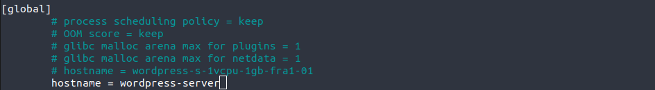
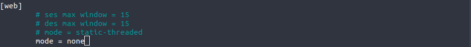
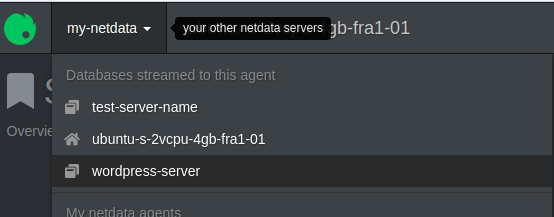
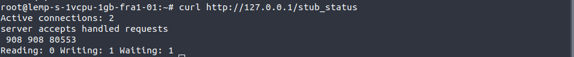
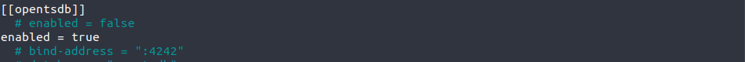
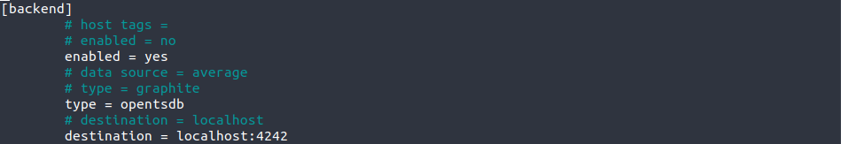
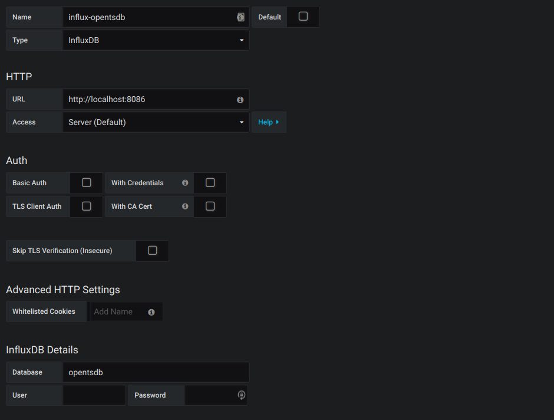
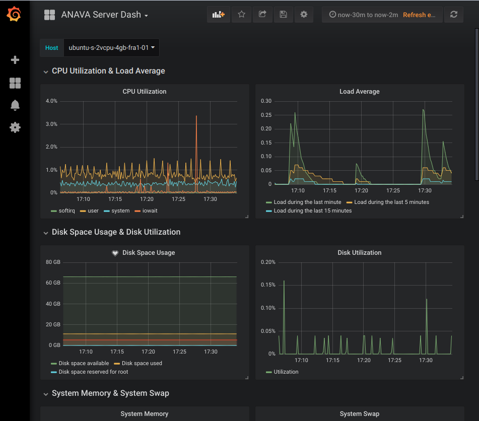
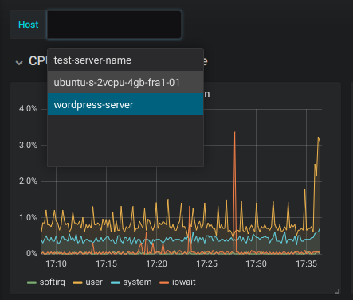

# Server Monitoring Dashboard

Instructions to install and setup tools for monitoring multiple servers.

The instructions can change depending on the system used. For this case we are using VPS that has **Ubuntu 18.04 (Bionic Beaver)** as their Operating System.

# Summary
* [Tools](#tools)
* [Netdata](#netdata)
  * [Installing Netdata](#installing-netdata)
  * [Netdata manual service activation](#netdata-manual-service-activation)
  * [Firewall configuration for Netdata (Optional)](#firewall-configuration-for-netdata-optional)
  * [Exploring Netdata's dashboard](#exploring-netdatas-dashboard)
  * [Optimize memory usage](#optimize-memory-usage)
  * [Master / Slave configuration](#master-slave-configuration)
    * [Master configuration](#master-configuration)
    * [Slave configuration](#slave-configuration)
  * [Monitoring Nginx](#monitoring-nginx)
* [InfluxDB](#influx-database)
  * [Install InfluxDB](#install-influxdb)
* [Linking Influx with Netdata](#linking-influx-with-netdata)
  * [InfluxDB Configuration](#influxdb-configuration)
  * [Netdata Configuration](#netdata-configuration)
* [Grafana](#grafana)
  * [Installing Grafana](#installing-grafana)
  * [Enabling Grafana's dashboards port](#enabling-grafanas-dashboards-port)
  * [Adding data sources](#adding-data-sources)
  * [Adding a dashboard](#adding-a-dashboard)

# Tools
[github]: ./images/github.png
To monitor the servers you will need the following tools:
1. [Netdata](https://netdata.io/) [![Github logo][github]](https://github.com/netdata/netdata)
2. [InfluxData(InfluxDB)](https://www.influxdata.com/) [![Github logo][github]](https://github.com/influxdata/influxdb)
3. [Grafana Dashboard](https://grafana.com/) [![Github logo][github]](https://github.com/grafana/grafana)

# Netdata
## Installing Netdata
Before we install anything, make sure the system package index is up to date.
```bash
sudo apt-get update
```
Next install Netdata's dependencies. The following are mandatory.
```bash
sudo apt-get install zlib1g-dev uuid-dev libmnl-dev gcc make autoconf autoconf-archive autogen automake pkg-config curl
```

***
`Optional`: You can also install these packages that are recommended by Netdata.
```bash
sudo apt-get install python python-yaml python-mysqldb python-psycopg2 nodejs lm-sensors netcat
```
***

Now, installing Netdata it self. It can easily installed by the following commands:

Make sure you run `bash` for your shell
```bash
bash
```

Install netdata, directly from github sources
```bash
bash <(curl -Ss https://my-netdata.io/kickstart.sh)
```

The output you'll see at first contains information on where Netdata will store all of it's components. You can read through these so you are a bit more familiar with how the program is spread out over the filesystem after its installation.
```
Installer Output
. . .
  It will be installed at these locations:

   - the daemon    at /usr/sbin/netdata
   - config files  at /etc/netdata
   - web files     at /usr/share/netdata
   - plugins       at /usr/libexec/netdata
   - cache files   at /var/cache/netdata
   - db files      at /var/lib/netdata
   - log files     at /var/log/netdata
   - pid file      at /var/run
. . .
```

Press `ENTER` to continue with the installation. After a moment, at the end of the output chain, you'll see the following message:
```
Installer Output
. . .
  ^
  |.-.   .-.   .-.   .-.   .-.   .  netdata                          .-.   .-
  |   '-'   '-'   '-'   '-'   '-'   is installed and running now!  -'   '-'  
  +----+-----+-----+-----+-----+-----+-----+-----+-----+-----+-----+-----+--->

  enjoy real-time performance and health monitoring...
```

Netdata is now installed and running successfully, and will run automatically upon rebooting the server as well.

## Netdata manual service activation
If you don't want to reboot your system you can always start it using `systemctl`
```bash
sudo systemctl start netdata
```

To make sure that Netdata is running, use this command
```bash
sudo systemctl status netdata
```

In case you wanted to stop Netdata -for any reason (we wont judge you)- use this command
```bash
sudo systemctl stop netdata
```

## Firewall configuration for Netdata (Optional)
If you don't have ufw or any firewall enabled on your system, you can skip this. Else, you'll need to allow the port that Netdata works on and by default it is `19999`.
```bash
ufw allow 19999/tcp
```
## Exploring Netdata's dashboard
You can access Netdata's dashboard using your web browser using the following url: `http://your.ip.address:19999`

It should look something like this:
Picture may contain a dashboard](./images/dashboard-overview.png "Netdata Dashboard overview")

## Optimize memory usage
You can optimize performance by reducing Netdata's memory usage. This reduction can be up to 40-60%.  
All you need to do is to enable `Kernel Same-page Merging (KSM)`

You will need to edit the file under name `/etc/rc.local`

***
`Important`: If you have this file in your system (you probably don't), here's what you can do:

You will create the file with this content:
```bash
#!/bin/bash
exit 0
```
You can use this command to do it:
```bash
printf '%s\n' '#!/bin/bash' 'exit 0' | sudo tee -a /etc/rc.local
```

Next, you'll need to make the file executable in order for the system to pull it automatically upon restart using this command:
```bash
sudo chmod +x /etc/rc.local
```

Now, just reboot your system:
```bash
sudo reboot
```
***

Now, that we have our `rc.local` file you can add the needed instructions. So, you need to edit the file.
```bash
sudo nano /etc/rc.local
```
And add these two lines:
```
echo 1 > /sys/kernel/mm/ksm/run
echo 1000 > /sys/kernel/mm/ksm/sleep_millisecs
```

The first command adds a 1 into the run KSM kernel file, which enables the feature. The second command tells the the KSM daemon to run once per second and evaluate 100 pages for de-duplication.

Now, you can whether reboot your system or do the following instructions:

```bash
sudo echo 1 > /sys/kernel/mm/ksm/run
sudo echo 1000 > /sys/kernel/mm/ksm/sleep_millisecs
```
Then, restart Netdata
```bash
sudo systemctl restart netdata
```

If go to `Deduper` under `Memory` in the Netdata dashboard you will see that the functionality has been enabled and fully functional.
Picture may contain another dashboard](./images/ksm.png "Memory > Deduper KSM")

## Master / Slave configuration
For security issues it is recommended to use the Master/Slave configuration for Netdata. In fact, Netdata doesn't have a configuration for authentication with InfluxDB so the solution is to block the public from accessing the database and the other Netdata instances that are on other servers must communicate only with the master Netdata server.

For that you need to configure both Master instance and slave instances.
`Note` you will need to generate a key to use it for the configuration. You can generate this key using this command:

```bash
uuidgen
```
An output example:
```bash
11111111-2222-3333-4444-555555555555
```

### Master configuration
The file to configure is `stream.conf`. To do that use this command:
```bash
sudo /etc/netdata/edit-config stream.conf
```

That should open `nano` editor in the terminal with the file. Go to the `[API_KEY]` section and replace it with you generated key and configure it as follows:
```bash
[11111111-2222-3333-4444-555555555555]
    enabled = yes
    default history = 3600
    default memory mode = save
    health enabled by default = auto
    allow from = *
```

Next, go the `[MACHINE_GUID]` and configure it as follows:
```bash
[MACHINE_GUID]
    enabled = yes
    history = 3600
    memory mode = save
    health enabled = yes
    allow from = *
```

***
`Note`: allow can be more specific by allowing specific IP addresses and denying others. To deny an IP use `!` right before the undesired address.
`Example`: `allow from = !10.1.2.3 10.*` will allow all IP addresses in `10.*` except `10.1.2.3`. The order is important: left to right, the first positive or negative match is used.
***

### Slave configuration
In this case two files need to be edited: `netdata.conf` (optional) and `stream.conf`.
Start with `netdata.conf`, use this command to edit the file:
```bash
sudo nano /etc/netdata/netdata.conf
```
Here you can edit the server name by setting the `hostname` field to your desired name:
```
...
[global]
  ...
  hostname = my-servers-name
...
```



Now, what really matters is the `stream.conf` setup, start by executing the following command in order to edit the file:
```bash
sudo /etc/netdata/edit-config stream.conf
```

Go to `[stream]` section and provide the following:
```bash
[stream]
  enabled = yes
  destination = MASTER-IP-ADDRESS:PORT
  api key = SAME-AS-MASTER
```
***
`Notes`:
* `MASTER-API-ADDRESS` is the address of your master server and `PORT` is by default `19999`
* `api key` should be the same as the master's key for our example it should be like this: `api key = 11111111-2222-3333-4444-555555555555`
***

As you no longer need the dashboard of the slave server, as it is accessible from the master dashboard, you can disable it. You can do that by disabling web mode in the `netdata.conf`.
```bash
...
[web]
  ...
  mode = none
...
```



Once you save all configurations you just need to restart the service:
```bash
sudo systemctl restart netdata
```

Connect to your master dashboard from your browser through the link `http://master.ip.address:19999` and you should be able to see the other servers in your servers list.



## Monitoring Nginx
To monitor Nginx on your server you need to enable `stub_status` in your Nginx configuration.
The configuration is located under `/etc/nginx/sites-available/`, if you display it's content you'll find at least a file named `default`, you might also find other files, for example if you are using Digital Ocean servers you'll find another file named `digitalocean`, if that file exists you want to edit it else you edit the `default` file. Now, go edit your configuration file:
```bash
sudo nano /etc/nginx/sites-available/digitalocean
```
Add this in `server` section:
```
server{
  ...
  location /{...}
  #this is what you need to add vvvv
  location /stub_status{
    stub_status;
    # Security: Only allow access from IP below.
    allow 127.0.0.1;
    # Deny anyone else
    deny all;
  }
  ...
}
```
Check if the confi file is okay with this command:
```bash
nginx -t
```
Now restart Nginx:
```bash
systemctl restart nginx
```
Check if the module is working correctly:
```bash
curl http://127.0.0.1/stub_status
```
It should output something like this:



# Influx Database
InfluxDB is an open-source time series database (TSDB) developed by InfluxData. It is written in Go and optimized for fast, high-availability storage and retrieval of time series data in fields such as operations monitoring, application metrics, Internet of Things sensor data, and real-time analytics.

## Install InfluxDB
Before starting with the installation, make sure that your system is up-to-date. Run these commands to make sure of that:
```bash
sudo apt-get update && sudo apt-get upgrade
```

Now, start executing the following these commands, they will add influxdb to your packages sources:
```bash
curl -sL https://repos.influxdata.com/influxdb.key | sudo apt-key add -
```
```bash
source /etc/lsb-release
```
```bash
echo "deb https://repos.influxdata.com/${DISTRIB_ID,,} ${DISTRIB_CODENAME} stable" | sudo tee /etc/apt/sources.list.d/influxdb.list
```

Now update your system and install InfluxDB:
```bash
sudo apt-get update && sudo apt-get install influxDB
```

Now, that Influx is installed, you need to start the service:
```bash
sudo service influxdb start
```

***
`Notes`:
If you want to connect to InfluxDB use this command:
```bash
influx
```

To see what databases are stored on your system you can use this instruction inside of `influx`:
```
SHOW DATABASES
```

To select a database, use this instruction:
```
USE databasename
```

# Linking Influx with Netdata
Now, that you have InfluxDB and Netdata on our master server we need to connect them together:

## InfluxDB Configuration
This step is easy and consists of only enabling `opentsdb` in your configuration. Go edit Influx's configuration file:
```bash
sudo nano /etc/influxdb/influxdb.conf
```
Set `enabled` to `true`:
```
...
[[opentsdb]]
  enabled = true
...
```



## Netdata Configuration
You need to enable and set the `[backend]` configuration in Netdata's configuration. It can be found in `/etc/netdata/netdata.conf`:
```bash
sudo nano /etc/netdata/netdata.conf

```
Edit as follows:
```
...
[backend]
  enabled = yes
  type = opentsdb
  destination = localhost:4242
  prefix = yourprefix
...
```



# Grafana
This is the tool that we are going to visualize the servers states in and set alarm rules in.
## Installing Grafana
Start by getting the link to your desired Grafana version for example `5.3.4` and then execute these three commands:
```bash
wget https://s3-us-west-2.amazonaws.com/grafana-releases/release/grafana_5.3.4_amd64.deb
```
```bash
sudo apt-get install -y adduser libfontconfig
```
```bash
sudo dpkg -i grafana_5.3.4_amd64.deb
```

## Enabling Grafana's dashboards port
Grafana dashboard works by default on port 3000, so we need to allow this port on our firewall:
```bash
sudo ufw allow 3000/tcp
```
Now you can access Grafana through this url `http://your.master.ip:3000` using your web browser. These are the default credentials:

username: `admin`

password: `admin`

## Adding data sources
To add a data source go to the left panel into `Configuration` > `Data Sources` and press `+ Add data source`. Configure it as follows:
```
Name: influx-opentsdb
Type: InfluxDB
Url: http://localhost:8086/
Database: opentsdb
```



## Adding a dashboard
Download [this file](./files/grafana-dashboard-template.json) and edit it as follows:
* Replace the term `myserverprefix` with your server prefix (`yourprefix`) from your Netdata's backend configuration.
* Replace `mylabel` with any label you want.

Now, in Grafana, go to the left panel `Create` > `Import` and press `Upload .json File` then select your file.
Next, name your dashboard as desired and select `influx-opentsdb` as your InfluxDB data source then press `Import`.
Now you can access you dashboards in one place:



You can check all the servers from here:


